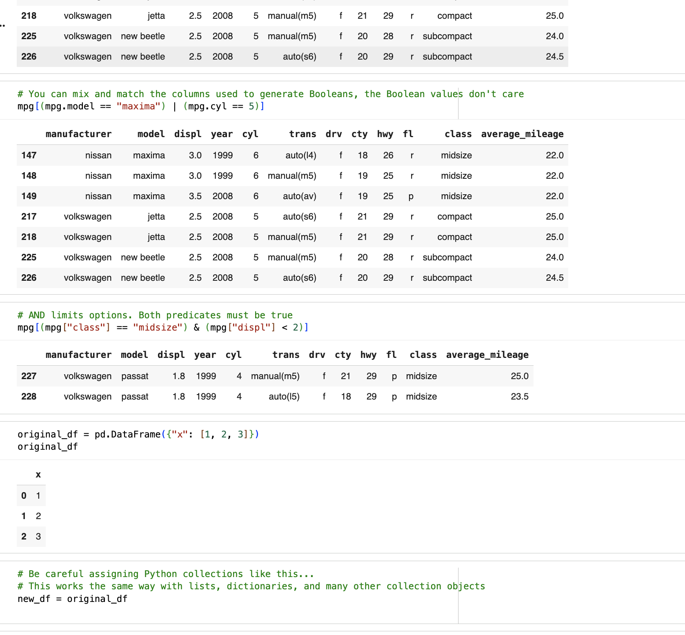
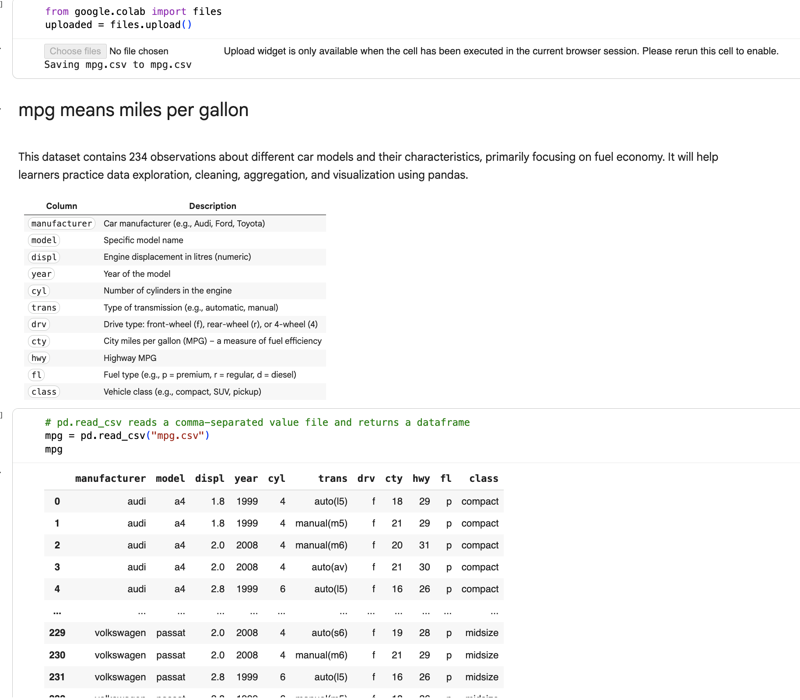
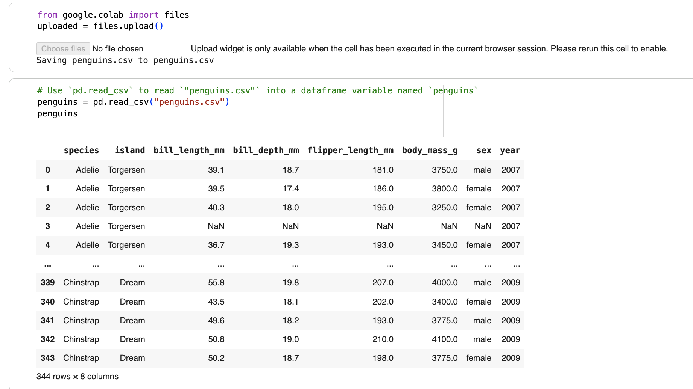
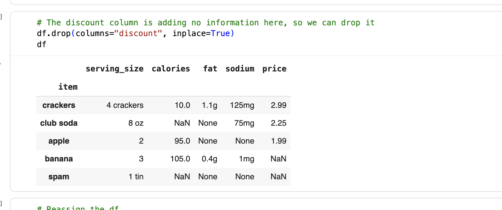
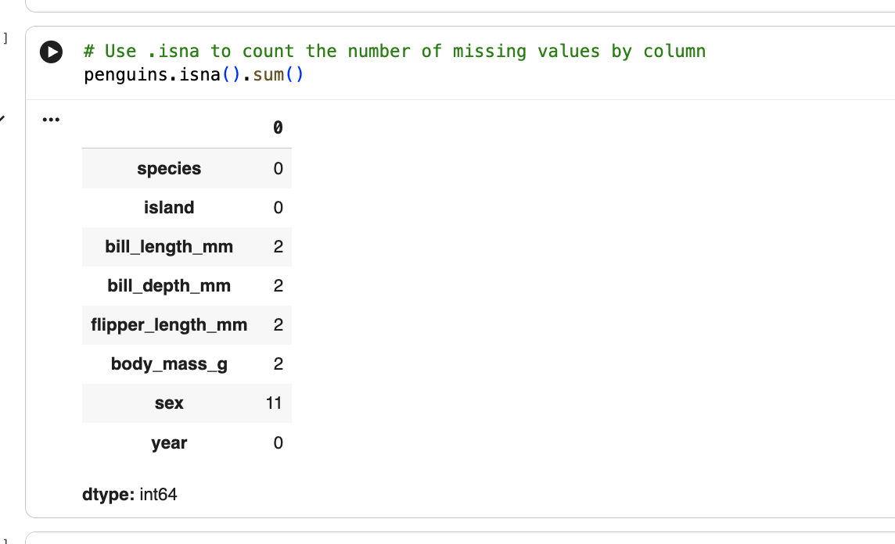

# 🐼 Pandas Practice – Google Colab Notebooks

This repository contains two Google Colab notebooks where I practiced and applied essential **Pandas** skills for data manipulation and cleaning.  
The project focuses on building strong foundations for working with real datasets using Python.

---

## 📂 Repository Contents

- **Notebook 1:** `Copy of PandasDataFrames_02_Day4_Task2 Mena.ipynb`  
- **Notebook 2:** `Copy of 03_Pandas_DataFrames_Continued_Day4_task3.ipynb`  
- **Datasets:** CSV files used during the exercises  
- **Screenshots folder:** Visual examples of the operations performed  

---

# 📓 Notebook 1 – Pandas DataFrames Basics

This first notebook covers the fundamental operations needed to understand and work with Pandas DataFrames.

### ✅ Skills Practiced

- Understanding **Pandas DataFrames** structure  
- Using **helpful Jupyter/Colab features**  
- Importing a dataset from a **CSV file**  
- Selecting **multiple columns**  
- Counting `True` values in a **Boolean Series**  
- Filtering rows using **Boolean masks**  
- Using logical operators:
  - `AND` (`&`)
  - `OR` (`|`)  
- Understanding **why and when to use `.copy()`**
- Sorting a DataFrame by one or more columns using `sort_values()`

📸 **Screenshots – Notebook 1**  

Example:  

---

# 📓 Notebook 2 – Pandas DataFrames (Continued): Handling Missing Values

The second notebook builds on the first by focusing on how to identify and clean missing data.

### ✅ Skills Practiced

- Finding missing values with:
  - `isnull()`
  - `isna()`
- Counting missing entries per column  
- Removing rows containing missing information  
- Dropping columns from a DataFrame using `drop()`  
- Understanding when to remove vs. keep missing data  

📸 **Screenshots – Notebook 2**  

Example:  

---

## 🎯 Goal of the Project

The purpose of this project is to develop practical skills in:

- Data cleaning  
- DataFrame manipulation  
- Boolean filtering  
- Handling missing data  
- Understanding dataset structure  

These are essential foundations for any data analysis or machine learning workflow.

---

## 🚀 Next Steps

To continue improving my Pandas skills, I plan to explore:

- GroupBy operations  
- Aggregations  
- Merging and joining DataFrames  
- Advanced filtering  
- Working with date columns  
- Applying functions with `apply()`  

---

Thanks for visiting this project! 🚀  
Feel free to explore the notebooks and datasets in this repository.

